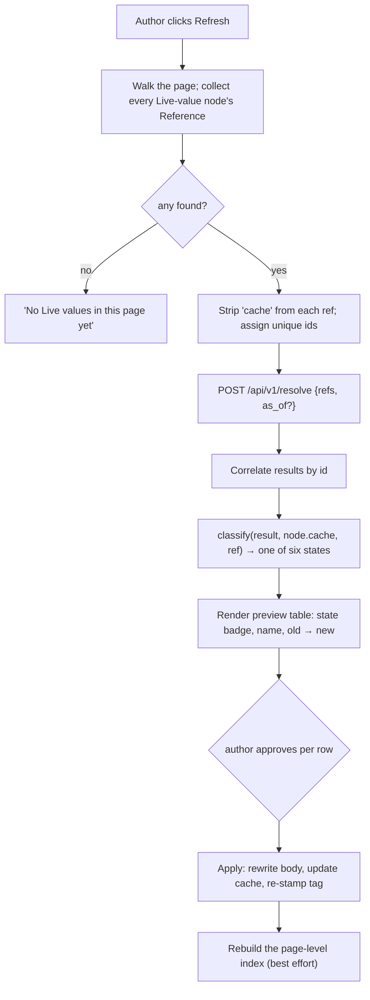

# ICD Manager (PLM) `/api/v1` — integration guide for Docmost

**Audience:** an engineer or agent working in the **Docmost** codebase who has
**no access to the ICD Manager source**. Everything needed to build a
"live PLM values in a Docmost page" feature is in this document.

**Goal:** reproduce, in Docmost, what the ICD Manager's Word add-in does — let
an author **insert** a value from the PLM into a page, and later, on one
**Refresh** action, pull every inserted value up to whatever the PLM says now,
with a diff preview before anything is written.

The server side already exists and is unchanged by this work. The PLM exposes a
JSON API at `/api/v1` that was built for exactly this
(the Word add-in is one client; Docmost would be the second). **No PLM-side
changes are required** for the read/refresh feature. Everything below describes
the API as it is today.

---

## Table of contents

1. [Mental model](#1-mental-model)
2. [Transport, conventions, and the CORS constraint](#2-transport-conventions-and-the-cors-constraint)
3. [Authentication](#3-authentication)
4. [Browse endpoints — building a Reference](#4-browse-endpoints--building-a-reference)
5. [`POST /api/v1/resolve` — the core endpoint](#5-post-apiv1resolve--the-core-endpoint)
6. [The client algorithm you must re-implement](#6-the-client-algorithm-you-must-re-implement)
7. [Docmost-specific design notes](#7-docmost-specific-design-notes)
8. [Optional: pushing Docmost pages into the PLM Documents registry](#8-optional-pushing-docmost-pages-into-the-plm-documents-registry)
9. [Edge cases and invariants](#9-edge-cases-and-invariants)
10. [curl smoke test](#10-curl-smoke-test)
11. [Appendix — complete field reference](#11-appendix--complete-field-reference)

---

## 1. Mental model

Four concepts. Use these names; they are the PLM's own vocabulary and using them
keeps the two codebases talking about the same thing.

### Live value

One managed span of content in a document that displays **one resolved PLM
value**. In Word it is a content control; in Docmost it will be a custom
editor node. It has two parts:

- a **body** — the rendered text/HTML the reader sees (`"3.3 V"`);
- a hidden **Reference** + **cache** — the pointer to the PLM and the diff
  baseline, carried *with the node* so copy/paste between pages keeps working.

### Reference

The stable address a Live value carries. Critically, a Reference is keyed **the
way the PLM's resolver is keyed** — on `(instance, name)` or `(design, name)` —
**never on a value-row id**. This is deliberate: in the PLM the *winning* row for
a given `(instance, name)` legitimately changes over time (someone creates an
**Override**, or a formula **Cascade** recomputes a derived value). A Live value
must track the *effective* value, so its address is the resolver's key, not a
row.

Consequences you get for free:

- **Re-parenting an instance is invisible** — instance UUIDs are stable.
- **Creating or deleting an Override is tracked automatically** — the effective
  value simply changes, which is the desired behaviour.
- **A parameter rename breaks the `name` key** — mitigated by a `param_uuid`
  repair anchor (see [rename repair](#63-rename-repair-renamed--re-point)).

### Resolve

Turning a batch of References into current values in **one** server round-trip:
`POST /api/v1/resolve {"refs": [...]}`. A page citing hundreds of values is one
request, not N. One bad ref never sinks the batch.

### Refresh — six display states

**Refresh** is the author action: collect every Live value's Reference, resolve
them in one batch, classify each result against the node's own cached baseline,
show a preview, and apply what the author approves.

| State | Meaning | What the body becomes |
|---|---|---|
| **Fresh** | Resolved, unchanged since last refresh | unchanged |
| **Changed** | Value differs from cached value | new value, in place |
| **Unit changed** | The unit moved (`g` → `kg`) | new value + unit, in place |
| **Error** | Source is an `error`-kind derived parameter, or is unset | `#ERROR` or `—` |
| **Renamed** | `(instance, name)` no longer resolves but `param_uuid` does | offer one-click re-point |
| **Broken** | Neither resolves (instance/design deleted, parameter hard-deleted) | **keep last content**, flag for manual repair |

> **Non-negotiable product rule:** an `error` or `unset` source renders a
> **visible sentinel** (`#ERROR` / `—`), *never* the last good number. These are
> engineering documents; a wrong-but-plausible number that a reviewer reads as
> live is the worst possible outcome. The cache keeps the last good value for the
> diff and the repair UX, but it is never displayed as if current.

---

## 2. Transport, conventions, and the CORS constraint

| | |
|---|---|
| Base URL | Whatever host the PLM is deployed at, e.g. `https://plm.internal` (dev: `http://localhost:8000`) |
| Prefix | `/api/v1` |
| **Trailing slash** | **None, ever.** `POST /api/v1/resolve` — `/api/v1/resolve/` is a **404**. |
| Content type | `application/json` on every request with a body |
| Response type | `application/json` on every response, including errors |
| Encoding | UTF-8 |

### Status codes

| Code | When |
|---|---|
| `200` | Success. Note: **per-ref failures inside `resolve` are still `200`** — they surface as a `status` on that result. |
| `400` | Malformed JSON body, or a structurally invalid payload (`refs` not a list; a required Document field missing). Body: `{"error": "<message>"}` |
| `401` | Missing / malformed / unknown / revoked bearer token, or bad credentials at the token endpoint. Body: `{"error": "authentication required"}` (or `{"error": "invalid credentials"}`) |
| `404` | A browse endpoint whose path UUID names an entity that does not exist. Body: `{"error": "instance not found"}` etc. |
| `405` | Wrong HTTP method on a valid route. **Auth is checked before the method**, so a token-less GET on a POST route returns `401`, not `405`. |

There is **no rate limiting** and **no pagination** on any endpoint.

### ⚠️ CORS: you must call the PLM from the Docmost **backend**

The PLM sets **no CORS headers** — no `Access-Control-Allow-Origin`, and a
preflight `OPTIONS` is not handled. The Word add-in gets away with direct
browser calls only because its task pane is *served by the PLM itself*, so it is
same-origin.

**A Docmost browser client calling the PLM directly will be blocked.** Route all
PLM traffic through the Docmost server (a controller/service that proxies), which
also has these benefits:

- the PLM bearer token never reaches the browser;
- one place to hold the base URL and per-user tokens;
- you can batch/cache server-side.

The alternative — asking the PLM team to add `django-cors-headers` — is a PLM-side
change and is *not* required by any of the flows in this document. Don't plan
around it.

### Authentication header

Every endpoint except the token exchange requires:

```
Authorization: Bearer <raw-token>
```

The API is gated **only** by this token. It is a second, independent auth path
beside the PLM's session login: a token-less request gets a JSON `401`, never a
redirect to a login page.

---

## 3. Authentication

### `POST /api/v1/auth/token` — exchange credentials for a bearer token

The only public endpoint. It *issues* a token, so it needs none.

**Request**

```http
POST /api/v1/auth/token HTTP/1.1
Content-Type: application/json

{
  "username": "mlambert",
  "password": "…",
  "name": "Docmost"
}
```

| Field | Required | Notes |
|---|---|---|
| `username` | yes | **Username, not email.** The PLM logs in by username; an email address will not authenticate even if it is the user's registered email. |
| `password` | yes | |
| `name` | no | Free-text label stored on the token row so a human can identify it later (e.g. `"Docmost"`, `"Docmost prod"`). Defaults to `""`. |

**Responses**

```jsonc
// 200
{ "token": "V0hZIEFSRSBZT1UgUkVBRElORyBUSElT…", "token_type": "Bearer" }

// 400 — body was not valid JSON
{ "error": "invalid JSON body" }

// 401 — wrong credentials, unknown user, or the user is inactive
{ "error": "invalid credentials" }
```

### Token properties you need to know

- **The raw token is shown exactly once.** The PLM stores only its SHA-256 hash.
  If you lose it, issue a new one; it cannot be recovered.
- **It is long-lived.** There is no expiry, no refresh token, no rotation. It
  stays valid until explicitly revoked.
- **Revocation is immediate** — a revoked token stops authenticating on the very
  next request (revocation is part of the lookup filter, not a post-hoc check).
- **Revocation is currently Django-admin only.** There is no self-service
  "revoke my tokens" UI yet, and no endpoint for it. Plan your UX around
  "ask an admin", or around simply issuing a fresh token.
- **`last_used_at` is stamped on every authenticated call** — every request
  performs one small write. Irrelevant at Docmost's traffic levels, but worth
  knowing before you build a health-check that polls the API every second.
- Issuing a token does **not** invalidate previous ones. Calling
  `/auth/token` repeatedly just accumulates rows. Store and reuse one per user.

### Token storage in Docmost

The Word add-in stores the token in the task pane's `localStorage` — appropriate
there (per-user, per-machine, and deliberately *not* written into the `.docx`, so
a shared document never carries a live credential).

**Docmost is a shared server app, so `localStorage` is the wrong home.** Store
the token server-side, encrypted at rest, keyed per Docmost user (or per
workspace if you decide a single service credential is acceptable — see the
attribution note in §8). Never embed a token in page content, and never send it
to the browser.

### ⚠️ Forthcoming change: token scopes

Today **every token has the same power**, and that includes the two write
endpoints in §8. A decision is on record (not yet implemented at time of
writing) to add a `scope` column with two values, `read` and `write`, such that:

- `POST /api/v1/auth/token` — the credentials-for-token exchange — will only
  ever mint a **read** token, and will accept no scope field;
- a **write** token will be issued only from a session-gated *Settings → API
  tokens* page in the PLM UI;
- existing tokens back-fill as **read**.

**Design your config for two token slots now** — one read token (obtained via
the exchange, used for browse + resolve) and one optional write token (pasted in
by an admin, used only for the Documents push in §8). If you do that, the change
lands as a config edit rather than a refactor.

---

## 4. Browse endpoints — building a Reference

Ten bearer-gated `GET` endpoints. They are thin wrappers over the *same*
resolvers `resolve` uses — there are no separate value semantics here — and they
exist so a UI can walk **System → instance tree → one instance's values** and
let an author pick something to insert.

All ten require the same bearer token as `resolve`; there is no lighter
read-only auth. All return `404 {"error": "<thing> not found"}` when the path
UUID names something that does not exist.

### 4.1 `GET /api/v1/systems`

The top of the instance-axis browse tree.

```jsonc
{
  "systems": [
    { "id": "550e8400-e29b-41d4-a716-446655440000", "name": "Satellite A" },
    { "id": "…", "name": "Ground segment" }
  ]
}
```

Ordered by name. No pagination — the workspace has tens of systems, not
thousands.

### 4.2 `GET /api/v1/systems/<system_uuid>/tree`

One System's instance tree, **flattened breadth-first**. The client rebuilds the
hierarchy from the `parent` links. A flat list is deliberate: it makes
re-parenting invisible, since instance UUIDs are stable.

```jsonc
{
  "system": { "id": "550e8400-…", "name": "Satellite A" },
  "root": "f1c2b3e4-…",          // null if the System has no root instance yet
  "instances": [
    { "id": "f1c2b3e4-…", "identifier": "SAT-A",     "design": "Satellite",  "parent": null },
    { "id": "a2b3c4d5-…", "identifier": "SAT-A-PWR", "design": "Power board", "parent": "f1c2b3e4-…" },
    { "id": "b3c4d5e6-…", "identifier": "",          "design": "GPU",         "parent": "f1c2b3e4-…" }
  ]
}
```

- `instances` is `[]` when the System has no root instance.
- Root first, then breadth-first; siblings ordered by creation time.
- `identifier` may be `""` — instances are not required to carry one. Fall back
  to `design` for display (that is what the Word pane does:
  `identifier || design`).
- `design` is the design **name** (a display string), not an id. If you need the
  design's UUID for a `design_spec` Reference, use the designs axis (§4.7).

### 4.3 `GET /api/v1/instances/<instance_uuid>/values`

The pick list of **effective parameters** on one instance — the main thing
authors insert. Each row already carries everything a Reference needs.

```jsonc
{
  "instance": { "id": "a2b3c4d5-…", "identifier": "SAT-A-PWR", "design": "Power board" },
  "values": [
    {
      "name": "Bus voltage",
      "param_uuid": "d47d93e1-…",       // the rename-repair anchor — store it
      "is_override": true,              // true = an instance Override shadows the design value
      "value": "3.3",                   // raw text, never pre-formatted
      "unit": "V",
      "formula": "",                    // non-empty when the parameter is derived
      "comment": "measured at TP4",     // the Effective comment — insertable separately
      "modified_at": "2026-06-28T10:00:00+00:00",
      "modified_by": "mlambert"
    }
  ]
}
```

Ordering: live instance parameters first (by creation time), then unshadowed
design parameters (by creation time).

### 4.4 `GET /api/v1/instances/<instance_uuid>/statuses`

```jsonc
{
  "statuses": [
    {
      "status_field": "9e8d7c6b-…",   // StatusField UUID — the Reference key
      "name": "Build status",
      "value": "Released",            // null when no option is assigned
      "color": "#2e7d32",             // null when unset
      "is_override": false
    }
  ]
}
```

The Reference for a status keys on the StatusField **UUID**, which is stable
across a field rename — so status Live values never break on a rename and need
no repair anchor.

### 4.5 `GET /api/v1/instances/<instance_uuid>/interfaces`

```jsonc
{
  "interfaces": [
    {
      "interface": "PWR-OUT-1",        // interface NAME — part of the Reference key
      "type": "Power",                 // InterfaceType name (display only)
      "params": [
        {
          "name": "Max current", "value": "2.5", "unit": "A",
          "formula": "", "comment": "",
          "modified_at": "2026-06-01T08:00:00+00:00", "modified_by": "mlambert"
        }
      ]
    }
  ]
}
```

Note the absence of a `param_uuid` here — interface parameters have no per-row
id, so an `interface_param` Reference has **no rename repair**. Renaming either
the interface or the field surfaces as **Broken** and needs manual re-pointing.
Surface that clearly in your UI.

### 4.6 `GET /api/v1/instances/<instance_uuid>/metadata`

A small, fixed whitelist of instance attributes exposed as insertable scalars.

```jsonc
{
  "metadata": [
    { "attr": "identifier",  "value": "SAT-A-PWR" },
    { "attr": "description", "value": "<p>…</p>" },
    { "attr": "design",      "value": "Power board" }
  ]
}
```

`attr` is always exactly one of `identifier`, `description`, `design`. Anything
else in a Reference comes back `unsupported_kind`.

> `metadata.description` returns the raw description HTML in a *scalar* slot.
> For rich rendering prefer the `description` kind (§4.9 / §5.4), which is the
> purpose-built path.

### 4.7 `GET /api/v1/designs`

```jsonc
{ "designs": [ { "id": "7f8e9d0c-…", "name": "Power board" } ] }
```

The top of the **design axis** — design-scope spec values, with no instance
overrides applied. This is the right axis when the page documents *the design*
rather than *a built unit*.

### 4.8 `GET /api/v1/designs/<design_uuid>/specs`

```jsonc
{
  "design": { "id": "7f8e9d0c-…", "name": "Power board" },
  "values": [
    {
      "name": "Bus voltage", "param_uuid": "d47d93e1-…",
      "value": "3.3", "unit": "V", "formula": "", "comment": "",
      "modified_at": "2026-05-02T09:12:00+00:00", "modified_by": "mlambert"
    }
  ]
}
```

Same row shape as §4.3 **minus `is_override`** (there are no overrides at design
scope).

### 4.9 `GET /api/v1/instances/<instance_uuid>/description` and `GET /api/v1/designs/<design_uuid>/description`

```jsonc
{
  "description": {
    "entity_type": "instance",     // or "design"
    "entity_id": "a2b3c4d5-…",
    "html": "<p>Regulated 3.3 V rail…</p>",
    "has_text": true               // false for an empty description
  }
}
```

The HTML is the PLM's stored rich text. It may contain `` tags pointing at
PLM-hosted figure URLs — see the [figure caveat](#9-edge-cases-and-invariants).

---

## 5. `POST /api/v1/resolve` — the core endpoint

One batch, one round-trip, results **in input order**.

### 5.1 Request

```http
POST /api/v1/resolve HTTP/1.1
Authorization: Bearer <token>
Content-Type: application/json

{
  "refs": [ <Reference>, <Reference>, … ],
  "as_of": "2026-06-01T00:00:00Z"      // optional; see §5.5
}
```

- `refs` **must** be a JSON array or you get `400 {"error": "'refs' must be a list"}`.
- An empty array is valid and returns `{"results": []}`.
- There is no documented cap on batch size. The Word add-in sends every Live
  value in a document in one call; hundreds is the design point. If a page ever
  cites thousands, chunk it yourself.
- **Unknown keys on a Reference are ignored by the server.** This is load-bearing:
  the Word add-in sends its whole client-side tag (minus the cache), including
  purely client-side fields like `format`, `v`, and `system`. You may do the same
  — send your node's attrs verbatim and let the server pick out what it knows.

### 5.2 Response

```jsonc
{ "results": [ <result>, <result>, … ] }
```

- **Same length and same order as `refs`.**
- Each result echoes the ref's `id` field **verbatim** in its own `id`. If a ref
  has no `id`, the result's `id` is `null`.
- **Give every ref a unique `id` within a batch.** Order alone is a valid
  correlation strategy, but ids make the code obviously correct and survive any
  future reordering. The Word add-in uses the stringified array index (`"0"`,
  `"1"`, …); a node id is a better choice for Docmost.
- **One bad ref never sinks the batch.** A missing instance, an unknown kind, a
  deleted parameter — all come back as that *result's* `status`, alongside `ok`
  results, at HTTP `200`.

### 5.3 Reference field matrix

Every kind shares one envelope. Server-read fields only:

| Field | Required for | Meaning |
|---|---|---|
| `id` | every kind (strongly recommended) | Client correlation id, echoed verbatim |
| `kind` | every kind | Dispatches to a resolver; see below |
| `instance` | `effective_param`, `comment`, `status`, `interface_param`, `metadata` | Instance UUID |
| `design` | `design_spec` | Design UUID |
| `name` | `effective_param`, `design_spec`, `comment`, `interface_param` | Parameter / field name — the resolver's name key |
| `param_uuid` | optional on `effective_param`, `design_spec`, `comment` | Rename-repair anchor. **Not supported for `interface_param`.** |
| `status_field` | `status` | StatusField UUID |
| `interface` | `interface_param` | Interface **name** |
| `attr` | `metadata` | `identifier` \| `description` \| `design` |
| `entity_type` + `entity_id` | `description` | `instance` \| `design` \| `system` \| `schema`, plus that entity's UUID |
| `table_type` + `owner` | `table` | `instance_params` \| `design_specs`, plus the owner's UUID |
| `as_of` | any (optional) | Per-ref override of the batch pin; `null` forces a live read for this ref |

Client-only fields the Word add-in also stores on the node (server ignores them,
but you will want the same): `format` (the render template), `cache` (the diff
baseline — **strip this before sending**), `v` (tag schema version), `system`
(breadcrumb context for the UI).

### 5.4 The eight kinds, with request/response examples

#### `effective_param` — the workhorse

The value in force for `(instance, name)`: the instance **Override** if one
exists, otherwise the design parameter of that name.

```jsonc
// ref
{ "id": "n1", "kind": "effective_param",
  "instance": "a2b3c4d5-…", "name": "Bus voltage",
  "param_uuid": "d47d93e1-…" }

// result
{ "id": "n1", "status": "ok", "name": "Bus voltage",
  "value": "3.3", "unit": "V", "formula": "",
  "comment": "measured at TP4",
  "modified_at": "2026-06-28T10:00:00+00:00", "modified_by": "mlambert" }
```

#### `design_spec` — the design-axis counterpart

Design-scope spec value; **instance overrides are not considered**.

```jsonc
{ "id": "n2", "kind": "design_spec",
  "design": "7f8e9d0c-…", "name": "Bus voltage", "param_uuid": "d47d93e1-…" }
```

Same result shape as `effective_param`.

#### `comment` — the effective comment of a parameter

Keyed and rename-repaired identically to `effective_param`. The comment text is
returned **in the `value` slot** so your generic classify/diff/format path
handles it with no special case. An empty comment is `unset`.

```jsonc
// ref
{ "id": "n3", "kind": "comment", "instance": "a2b3c4d5-…",
  "name": "Bus voltage", "param_uuid": "d47d93e1-…" }

// result
{ "id": "n3", "status": "ok", "name": "Bus voltage",
  "value": "measured at TP4", "unit": "" }
```

#### `status` — an effective status

```jsonc
// ref
{ "id": "n4", "kind": "status",
  "instance": "a2b3c4d5-…", "status_field": "9e8d7c6b-…" }

// result
{ "id": "n4", "status": "ok", "name": "Build status",
  "value": "Released", "unit": "", "color": "#2e7d32" }
```

`color` is the winning option's colour — useful if you want to render a chip
rather than plain text. `unset` when no option is assigned.

#### `interface_param` — one field of one effective interface

```jsonc
// ref
{ "id": "n5", "kind": "interface_param", "instance": "a2b3c4d5-…",
  "interface": "PWR-OUT-1", "name": "Max current" }

// result
{ "id": "n5", "status": "ok", "name": "Max current",
  "value": "2.5", "unit": "A", "formula": "", "comment": "",
  "modified_at": "…", "modified_by": "…" }
```

`not_found` with `"detail": "interface"` when the interface name is gone;
`"detail": "name"` when the field is gone. **No rename repair on this kind.**

#### `metadata` — a whitelisted instance attribute

```jsonc
// ref
{ "id": "n6", "kind": "metadata", "instance": "a2b3c4d5-…", "attr": "identifier" }

// result
{ "id": "n6", "status": "ok", "name": "identifier", "value": "SAT-A-PWR", "unit": "" }
```

An `attr` outside the whitelist returns `{"status": "unsupported_kind", "kind": "metadata"}`.

#### `description` — rich HTML

```jsonc
// ref
{ "id": "n7", "kind": "description",
  "entity_type": "instance", "entity_id": "a2b3c4d5-…" }

// result
{ "id": "n7", "status": "ok",
  "name": "SAT-A-PWR",                       // entity label: identifier, else name
  "value": "<p>Regulated 3.3 V rail…</p>",   // same as html, so the generic diff path works
  "html":  "<p>Regulated 3.3 V rail…</p>",
  "unit": "" }
```

- `entity_type` accepts `instance`, `design`, `system`, `schema`. Anything else
  is `unsupported_kind`.
- An empty description is `unset` → render the `—` sentinel.
- Only **entity-level** descriptions are exposed. Per-section descriptions are
  out of scope for this API.

#### `table` — a generated table

The whole parameter list of an instance (or spec list of a design), rendered as a
real table. **Refresh regenerates it wholesale** — rows may appear or disappear,
not merely change — which is a different update model from the scalar in-place
rewrite.

```jsonc
// ref
{ "id": "n8", "kind": "table", "table_type": "instance_params", "owner": "a2b3c4d5-…" }

// result
{ "id": "n8", "status": "ok", "table_type": "instance_params",
  "columns": ["Parameter", "Value", "Unit"],
  "rows": [
    ["Bus voltage", "3.3", "V"],
    ["Mass",        "—",   "kg"],      // unset → the same sentinel a scalar would show
    ["Efficiency",  "#ERROR", ""]      // error-kind derived parameter
  ] }
```

- `table_type` is `instance_params` (owner = instance UUID) or `design_specs`
  (owner = design UUID). Anything else is `unsupported_kind`.
- Cells are **already stringified**, and error/unset cells already carry the
  `#ERROR` / `—` sentinels — do not re-derive them.
- An owner with no parameters is still `ok`, with `"rows": []`. An empty table is
  a valid, non-stale answer.

### 5.5 The `as_of` pin (point-in-time reads)

Send `as_of` on the batch and every ref resolves as of that instant, reconstructed
from the PLM's value history. This is how you pin a page to a review baseline.

```jsonc
{ "refs": [...], "as_of": "2026-06-01T00:00:00Z" }
```

- **Format:** ISO-8601. **Send UTC with an explicit offset or `Z`.** A naive
  datetime is interpreted in the server's timezone (currently UTC) — don't rely
  on that.
- **Per-ref override:** a ref may carry its own `as_of`. A ref with
  `"as_of": null` forces a **live** read even under a batch pin.
- **An unparseable pin degrades to a live read — it is never a `400`.** A page
  pinned with a malformed date still resolves to current values rather than
  failing. Validate client-side if you want to catch typos.
- **Where to store the pin:** it is a *document-level* property that *should*
  travel with the page (unlike the token). Store it on the Docmost page, not in
  per-user settings.

**Two documented non-faithful cases** — call them out in your UI if you expose
pinning:

| Kind | Behaviour under `as_of` |
|---|---|
| `status` | **No-op.** A status is a single row updated in place, with no append-only history, so there is nothing to reconstruct. A pinned read silently returns the **current** status. |
| `metadata` | **No-op.** These attributes keep no value history. |

Everything else (`effective_param`, `design_spec`, `comment`, `interface_param`,
`description`, `table`) reconstructs faithfully. For `interface_param` the
interface *structure* is read live and only the *value* travels back in time.

### 5.6 Result statuses

These are **server-side facts about the source**. The six *display* states in §1
are a client-side classification derived from these plus your cached baseline.

| `status` | Meaning | Extra fields |
|---|---|---|
| `ok` | Resolved to a usable value | scalars: `value`, `unit`, `formula`, `comment`, `modified_at`, `modified_by` · `status`: also `color` · `description`: `html` · `table`: `columns`, `rows` |
| `error` | The source is an `error`-kind derived parameter (its formula failed) | `name` |
| `unset` | The parameter/field/attribute exists but has no value | `name` |
| `renamed` | The name key missed, but `param_uuid` still resolves | `name` = the **current** name; plus the value fields *if* the renamed parameter currently has a usable value |
| `not_found` | Neither the key nor `param_uuid` resolves, or the owning entity is gone | `detail`: which lookup failed — `instance`, `design`, `name`, `interface`, `status_field`, `entity`, `owner` |
| `unsupported_kind` | This server version doesn't implement the requested `kind` (or a `metadata` `attr` / `description` `entity_type` / `table` `table_type` outside its whitelist) | `kind` |

> **Forward compatibility:** an unrecognised `kind` degrades to
> `unsupported_kind` rather than erroring the batch, so a newer client talking to
> an older PLM survives. Treat `unsupported_kind` as **Broken** (keep existing
> content, flag it), not as a crash.

**Values are always raw text + unit.** The PLM stores every value as text, and the
API never pre-formats a number. Formatting is entirely yours (§6.2).

---

## 6. The client algorithm you must re-implement

This is the part that does not exist on the server. Below is precisely what the
Word add-in does, so Docmost can behave identically.

### 6.1 What a Live value node must carry

The Word add-in stores one JSON blob in the content control's `tag`:

```jsonc
{
  "v": 1,                             // tag schema version — reject nodes with a different v
  "kind": "effective_param",
  "instance": "a2b3c4d5-…",
  "name": "Bus voltage",
  "param_uuid": "d47d93e1-…",
  "system": "550e8400-…",             // client-only: breadcrumb/UI context
  "format": "{value} {unit}",         // client-only: render template
  "cache": {                          // client-only: the diff baseline
    "value": "3.3",
    "unit": "V",
    "at": "2026-06-28T10:00:00.000Z"
  }
}
```

**The design decision worth preserving:** the pointer *and* its diff baseline
live **on the node**, not in a document-level index. That is what makes
copy/paste between pages work — a Live value pasted elsewhere is immediately
correct and self-describing. Any document-level index you build (see §6.7) must
be a pure, rebuildable convenience, never authoritative.

**Word-specific constraint you do NOT inherit:** OOXML caps a content control's
`tag` at 255 characters, which is why the rich kinds cache only a *hash* rather
than the content (§6.5). Docmost's node attributes have no such cap, so you
*could* cache full content — but the hash approach is smaller, keeps the two
implementations comparable, and is what the reference implementation does. Prefer
it unless you have a reason not to.

### 6.2 Rendering: format templates

The body text is client-side string interpolation over the resolve result.
Replace `{key}` with `result[key]`, mapping null/undefined to `""`, then trim:

```js
function render(format, fields) {
  return (format || "{value} {unit}")
    .replace(/\{(\w+)\}/g, (_, key) => (fields[key] == null ? "" : String(fields[key])))
    .trim();
}
```

Default format per kind (what the Word pane uses):

| Kind | Default format |
|---|---|
| `effective_param`, `design_spec`, `interface_param` | `"{value} {unit}"` |
| `status`, `metadata`, `comment` | `"{value}"` |
| `description`, `table` | n/a — rich kinds are not format-driven |

Interpolatable keys are whatever the result carries: `value`, `unit`, `name`,
`formula`, `comment`, `modified_at`, `modified_by`, and `color` for statuses.
A format like `"{value} {unit} (as of {modified_at})"` works with no server
change. Store the chosen format **on the node**, so re-formatting one Live value
never affects another.

### 6.3 Refresh: collect → resolve → classify → preview → apply



**Classification — implement exactly this.** Scalar kinds:

```js
switch (result.status) {
  case "ok":
    if (cache && (result.unit  || "") !== (cache.unit  || "")) return "unit_changed";
    if (cache && (result.value || "") !== (cache.value || "")) return "changed";
    return "fresh";
  case "error":    return "error";
  case "unset":    return "error";       // both render a sentinel; both shade as Error
  case "renamed":  return "renamed";
  default:         return "broken";      // not_found, unsupported_kind
}
```

Rich kinds (`description`, `table`):

```js
switch (result.status) {
  case "ok":    return richHash(result) === cache.hash ? "fresh" : "changed";
  case "unset": return "error";
  default:      return "broken";
}
```

Note the ordering: **unit change is checked before value change**, so a
simultaneous unit+value move reports as *Unit changed*. Units are auto-applied,
never held back for approval — but they are surfaced in the summary, because a
silent `g`→`kg` is exactly the kind of drift a reviewer must see.

**Body text for the new content:**

```js
function bodyFor(result, ref) {
  if (result.status === "ok" || result.status === "renamed")
    return result.value ? render(ref.format, result) : "—";
  if (result.status === "unset") return "—";
  if (result.status === "error") return "#ERROR";
  return null;   // broken → write nothing; keep whatever is in the page
}
```

**On apply, per approved node:**

1. Rewrite the body (skip if `bodyFor` returned `null`).
2. If `status` is `ok` or `renamed`: set `cache = {value, unit, at: <now ISO>}`
   and persist the (possibly re-pointed) Reference back onto the node.
   **Do not update the cache on `error`/`unset`/`broken`** — the cache holds the
   *last good* value for the diff and repair UX.
3. Apply the state's visual treatment (the Word add-in uses highlight shading:
   Fresh = none, Changed = yellow, Unit changed = turquoise, Error = red,
   Renamed = pink, Broken = grey). In Docmost a CSS class on the node is the
   natural equivalent — but keep Error visually loud.

**Preview before apply is not optional.** A batch refresh that silently rewrites
a review pack is unreviewable; the whole point of batching is that it enables a
diff-before-apply screen. Let the author untick individual rows. Broken rows
should be non-applicable (nothing to apply).

### 6.4 Rename repair (`renamed` → re-point)

A parameter rename in the PLM moves the `name` key, so `(instance, name)` stops
resolving. But the rename mutates the parameter row **in place**, keeping its
UUID and full value history — which is why the Reference carries `param_uuid`.

Server behaviour: if `(instance, name)` misses but `param_uuid` still resolves
**within that instance's or design's scope**, the result is
`{"status": "renamed", "name": "<current name>"}`, plus the current value fields
when the parameter has a usable value.

Client behaviour (one-click re-point):

1. Show "renamed to *«New name»*" with a **Re-point** button.
2. On click: set `ref.name = result.name`, re-resolve **that one ref** in a
   single-item batch, and re-classify.
3. Persist the new `name` into the node's Reference **only on Apply**.

`param_uuid` lookups are **scoped**: a UUID from a different instance's parameter
never resolves. And a parameter that was *deleted* (not renamed) is genuinely
unrecoverable — that correctly surfaces as `not_found` → **Broken** → manual
re-pointing. Give Broken nodes a "re-point manually" affordance that reopens the
browse picker.

### 6.5 Rich kinds: hashing, and the two different update models

The rich kinds diff on a **content hash**, not on value/unit. The Word add-in
uses djb2 → unsigned hex — cheap, stable, and ample for change detection (it is
not a security hash):

```js
function contentHash(s) {
  let h = 5381;
  const str = String(s == null ? "" : s);
  for (let i = 0; i < str.length; i++) h = ((h << 5) + h + str.charCodeAt(i)) | 0;
  return (h >>> 0).toString(16);
}
function tableHash(result) {
  return contentHash(JSON.stringify(result.columns || []) + "|" + JSON.stringify(result.rows || []));
}
function richHash(result) {
  return result.table_type ? tableHash(result) : contentHash(result.html);
}
```

The node's cache for a rich kind is `{ "hash": "<hex>", "at": "<ISO>" }`.
**Keep the exact same hash function if you want a Live value to survive being
copied between a Word document and a Docmost page** — otherwise every
cross-tool paste reads as *Changed* on first refresh. (Harmless, but noisy.)

Two distinct update models, and they matter:

- **`description`** — re-render the HTML in place. Word delegates HTML→OOXML to
  the host; Docmost should convert the HTML into its editor's document model.
  The server transports the stored HTML unchanged; there are no new value
  semantics here.
- **`table`** — **regenerate wholesale** from `columns` + `rows`. Do *not* try to
  patch rows in place: parameters can be added and deleted, so the row set is not
  stable. Blow the table away and rebuild it.

**When inserting a table**, fetch its rows via `resolve` (not from the browse
list) so the cached hash matches exactly what the next Refresh will compare
against. Otherwise the very first Refresh reports a spurious *Changed*.

### 6.6 Insert flow

1. Author browses: **Systems → tree → instance**, or **Designs → design**.
2. For an instance, the Word pane loads all five endpoints in parallel
   (`/values`, `/statuses`, `/interfaces`, `/metadata`, `/description`) and
   renders one pick section per kind, each row showing a preview of what will be
   inserted (`previewText` = the rendered format, or `(unset)`).
3. On **Insert**: create the node with the Reference + `format` + a cache seeded
   from the browse row's `value`/`unit`, and a body of the rendered text — or `—`
   when the value is empty.
4. Rebuild the page-level index (§6.7), best-effort.

Two secondary actions worth copying: a **`+ comment`** button on any parameter
row that has a non-empty comment (inserts the `comment` kind alongside the
value), and a standalone **Insert table** action per instance/design.

### 6.7 The page-level index (optional but recommended)

Word keeps a **Live-value manifest** — a document-level custom XML part listing
every Live value the document cites — rebuilt by walking the nodes after every
insert/apply. Its rules:

- **Pure convenience.** Never read by Refresh, never authoritative. Always
  re-derivable by walking the nodes.
- **A write failure is swallowed** so it can never block an insert.
- The **Audit** view ("what PLM values does this page cite?") walks the *nodes*,
  not the manifest.

In Docmost the natural equivalent is a page-level metadata column or a derived
index table in your database. The big win it unlocks, which Word cannot easily
do, is the **reverse query**: *"which pages cite this parameter?"* If you
maintain a server-side index of `(page_id, kind, instance/design, name)` you can
answer that, and even notify page owners when a cited value changes. That is a
genuine Docmost-only feature — but keep it derived, never authoritative.

---

## 7. Docmost-specific design notes

These are recommendations, not requirements — you know the Docmost codebase and
I do not. They flag where the Word design does **not** transfer directly.

### Where the Reference lives

Word used a content control because it is the only Word primitive that is
simultaneously visible in the sentence, programmatically enumerable, a carrier of
hidden metadata, visually markable, and durable across edits and copy/paste.

The equivalent in a ProseMirror/TipTap-based editor is a **custom inline node
with attributes** — enumerable via a document walk, carries arbitrary attrs,
renders with its own node view, and survives copy/paste (attrs travel with the
slice). An inline **mark** on plain text is the weaker alternative: marks split
and merge on edit, so the pointer can fragment. Prefer a node.

Whatever you choose, hold to the invariant: **the rendered body is never
machine-read.** Diff and unit-drift detection read the node's cached attrs,
never the prose. That is what lets authors freely reformat the surrounding
sentence without confusing Refresh.

### Collaborative editing

If Docmost page content is a CRDT (Yjs) document, a Refresh that rewrites node
content must go through the same editing pipeline as a human edit — a client-side
editor transaction, or a server-side mutation that respects the CRDT — not a raw
overwrite of stored content. Two failure modes to think about up front:

- a server-side rewrite bypassing the CRDT can be clobbered by, or clobber, a
  concurrent human edit;
- a batch apply touching hundreds of nodes in one transaction may be worth
  chunking, so the collaborative session stays responsive.

The safest starting point is **Refresh runs in the author's editor session**,
exactly as the Word add-in does: one person, one document, explicit approval. A
background/server-side refresh is a genuinely harder second phase — and note that
it also has no author present to approve the diff, which conflicts with §6.3's
preview rule.

### Permissions

The PLM token authenticates **one PLM user**, and the API exposes the whole
workspace to whoever holds it — there is no per-system or per-instance
authorisation on `/api/v1`. So:

- a **shared service token** means every Docmost user who can edit a page can
  read every value in the PLM;
- a **per-user token** (each Docmost user does the credentials exchange once with
  their own PLM login) keeps the audit trail honest and is the closer analogue of
  the Word add-in.

Prefer per-user tokens. If you fall back to a service token, be explicit about
it in the UI, and note that it also determines who the **write** path (§8) is
attributed to.

### Failure UX

Every PLM call can fail with the network down or the PLM restarting. The rule
that matters: **a failed refresh must leave the page exactly as it was**. Never
half-apply a batch, and never let a transport failure be mistaken for a `broken`
Live value — Broken means "the PLM answered, and the value is gone", which is a
completely different message to the author.

---

## 8. Optional: pushing Docmost pages into the PLM Documents registry

This is a **separate, second integration**, in the opposite direction. The PLM
has a **Documents** registry: it tracks *references* to documents that live
elsewhere — SharePoint, S3, OneNote, **and Docmost** — and attaches them to
designs, instances, and systems. It **never holds the bytes**; every version
stores a reference URL.

If Docmost pushes its pages here, engineers browsing a PLM instance see "the
docs for this unit" including the relevant Docmost pages. `docmost` is an
anticipated source type.

> **These are write endpoints.** Today they are gated by the *same* token as the
> reads — see the [scope warning](#️-forthcoming-change-token-scopes). Treat the
> token you use here as a separate, admin-provisioned credential from day one.

### `POST /api/v1/documents` — idempotent upsert

```http
POST /api/v1/documents HTTP/1.1
Authorization: Bearer <token>
Content-Type: application/json

{
  "document_id": "DOCMOST-page-9f3a",
  "name": "Power board integration notes",
  "type": "ICD",
  "description": "Living notes from the integration campaign",
  "version": {
    "version": "1.4.0",
    "url": "https://docmost.internal/s/eng/p/power-board-notes",
    "filename": "Power board integration notes",
    "source_type": "docmost",
    "responsible": "M. Lambert",
    "status": "Released"
  },
  "attachments": [
    { "type": "instance", "id": "a2b3c4d5-…" },
    { "type": "design",   "id": "7f8e9d0c-…" }
  ]
}
```

**Semantics — read these carefully, two of them are destructive-by-design:**

- **`document_id` is your external correlation key**, and it is what the upsert
  keys on. A fresh id creates; a matching id **always updates in place** (never
  a "duplicate id" rejection). The PLM's internal UUIDs are never handed to
  integrators. Pick a stable id derived from the Docmost page id.
- **`version` is upserted on `(document, x.y.z)`.** Re-posting the same triple
  updates it in place; a new triple appends a version. The version string must be
  a strict `major.minor.patch` triple of non-negative integers — anything else is
  a `400`. Decide now how a Docmost page's revision maps onto `x.y.z`.
- ⚠️ **`attachments` is the DECLARATIVE FULL SET for this document.** It is
  reconciled on every push: any attachment not in the list is **removed**.
  Omitting `attachments` entirely reconciles the document down to **zero**
  attachments. Always send the complete current set.
- **`type`, `source_type`, and `status` are resolved by their exact label
  strings** against workspace vocabularies configured in PLM Settings. An unknown
  label is a `400`, not an auto-create. Your integration must either be
  configured with labels that exist, or fail loudly with a clear message telling
  the admin to add the vocabulary entry. There is **no endpoint to list the
  available labels** — this must be configuration.
- **`name` is workspace-unique.** Reusing another document's name is a `400`.
- **All three writes are one transaction.** A rejected push changes nothing.

**Responses**

```jsonc
// 200
{ "document_id": "DOCMOST-page-9f3a",
  "name": "Power board integration notes",
  "version": "1.4.0",
  "created": true }        // false when it was an update

// 400 — boundary validation
{ "error": "Unknown source_type: 'Docmost Page'" }
{ "error": "'name' is required" }
{ "error": "'1.4' is not a well-formed major.minor.patch version" }
{ "error": "attachment target not found: instance 'a2b3c4d5-…'" }
```

Field reference:

| Field | Required | Notes |
|---|---|---|
| `document_id` | yes | Non-blank string, workspace-unique, your correlation key |
| `name` | yes | Non-blank, workspace-unique |
| `type` | yes | Exact `DocumentType` label |
| `description` | no | Defaults `""` |
| `version` | yes | Object, see below |
| `version.version` | yes | `"x.y.z"`, non-negative integers |
| `version.source_type` | yes | Exact `SourceType` label |
| `version.status` | yes | Exact `DocumentStatus` label |
| `version.url` | no | The reference URL — in practice always send it |
| `version.filename` | no | Display label for the reference |
| `version.responsible` | no | Free-text person |
| `attachments` | no (but see warning) | `[{"type": "design"\|"instance"\|"system", "id": "<uuid>"}]` |

### `DELETE /api/v1/documents/<document_id>`

Soft-deletes into the PLM's Waste basket, addressed by the same external
`document_id`.

```jsonc
// 200
{ "document_id": "DOCMOST-page-9f3a", "discarded": true }

// 404 — no live document with that id (already deleted, or never existed)
{ "error": "document not found" }
```

Deleting something already gone is a `404`, not an error worth distinguishing —
treat it as success in an idempotent sync.

### Attribution

Write endpoints stamp the **token owner's username** as the actor on the PLM's
audit trail. If you use a shared service token, every push reads as that one
account. If that matters for your audit story, use a dedicated PLM user for the
integration (e.g. `docmost-integration`) so the trail is at least
self-describing.

---

## 9. Edge cases and invariants

Behaviours the PLM guarantees, and traps worth knowing before you hit them.

**Auth and transport**

- A token-less call to any gated endpoint is `401` JSON — **never** a redirect to
  a login page. If you ever see a `302`, you have hit a non-API route.
- **A revoked token stops working immediately**, mid-session. Handle `401` on any
  call by clearing the stored token and prompting for re-authentication (that is
  what the Word pane does).
- **Auth is checked before the HTTP method.** A token-less `GET` on `/resolve` is
  `401`, not `405`.
- Trailing slashes 404. No exceptions.

**Resolve**

- **One bad ref never fails the others.** A `not_found` result sits beside an
  `ok` result in the same response, in the original order.
- Results are in **input order**, always — but correlate on `id` anyway.
- An **unparseable `as_of` silently degrades to a live read**. It is never a
  `400`. If a user typo'd the pin date, they will get *current* values with no
  warning — validate the date client-side.
- `as_of` is a **documented no-op for `status` and `metadata`** (no history to
  reconstruct). A pinned page's status Live values silently read live. This is
  the one place the As-of pin is not faithful; say so in your UI if you expose
  pinning.
- **`param_uuid` repair is scoped.** A stray UUID from a different instance's
  parameter never resolves — it comes back `not_found`, not a wrong value.
- **A reconstructed unit falls back to the parameter's *current* unit** when no
  unit-change row precedes the `as_of` instant (a never-changed unit has no
  historical row to reconstruct from). So an `as_of` read always carries a usable
  unit; it just may be the present-day one.
- `formula` is non-empty when the parameter is **derived**. You may want to badge
  derived values differently — a derived value changes when *its inputs* change,
  which is not obvious from the value alone.

**Content**

- **Values are text, always.** `"3.3"` is a string. Never parse and re-format a
  number — the PLM stores exactly what an engineer typed, and re-formatting can
  silently change significant figures.
- **Description HTML may reference PLM-hosted figures** via
  `">` (a root-relative path baked into the stored
  HTML). Two problems follow. First, the path is **relative to the PLM**, so it
  resolves against Docmost's own origin unless you rewrite it to an absolute PLM
  URL. Second, that route is **session-gated, not token-gated** — a bearer token
  will *not* fetch it — so even the absolute URL fails for a reader with no PLM
  session. Decide deliberately: strip images, or download the bytes at insert
  time and re-host them in Docmost, or accept broken images. **Test this early**;
  it is the most likely unpleasant surprise in the `description` kind.
- **Description HTML is arbitrary stored HTML.** Sanitise it before inserting it
  into a Docmost page, the same as any other untrusted rich text.
- `identifier` can legitimately be `""` on an instance. Always fall back to the
  design name for display.
- **`value` can be `null` as well as `""`** in browse payloads. Treat both as
  unset.

**Deployment**

- The PLM is typically deployed on an internal host behind an nginx reverse
  proxy with an internal-CA-signed certificate. If Docmost's backend does not
  trust that CA, TLS verification fails. Get the CA cert into Docmost's trust
  store — **do not** disable certificate verification.
- `ALLOWED_HOSTS` is server-side config. If you reach the PLM by an unexpected
  hostname you may get a Django `400`; use the host the PLM is configured for.

---

## 10. curl smoke test

Run this against a dev PLM before writing a line of Docmost code. If all five
steps work, the API contract is understood.

```bash
BASE="http://localhost:8000"

# 1. Get a token
TOKEN=$(curl -sS -X POST "$BASE/api/v1/auth/token" \
  -H 'Content-Type: application/json' \
  -d '{"username":"YOUR_USER","password":"YOUR_PASS","name":"docmost-smoke"}' \
  | python3 -c 'import sys,json; print(json.load(sys.stdin)["token"])')
echo "token: ${TOKEN:0:8}…"

# 2. List systems
curl -sS "$BASE/api/v1/systems" -H "Authorization: Bearer $TOKEN" | python3 -m json.tool

# 3. Walk one system's tree  (paste a system id from step 2)
SYS="…"
curl -sS "$BASE/api/v1/systems/$SYS/tree" -H "Authorization: Bearer $TOKEN" | python3 -m json.tool

# 4. List one instance's effective parameters  (paste an instance id from step 3)
INST="…"
curl -sS "$BASE/api/v1/instances/$INST/values" -H "Authorization: Bearer $TOKEN" | python3 -m json.tool

# 5. Resolve a batch — a good ref, a deliberately broken one, and a table
curl -sS -X POST "$BASE/api/v1/resolve" \
  -H "Authorization: Bearer $TOKEN" -H 'Content-Type: application/json' \
  -d "{\"refs\":[
        {\"id\":\"a\",\"kind\":\"effective_param\",\"instance\":\"$INST\",\"name\":\"PASTE_A_REAL_NAME\"},
        {\"id\":\"b\",\"kind\":\"effective_param\",\"instance\":\"$INST\",\"name\":\"no such parameter\"},
        {\"id\":\"c\",\"kind\":\"table\",\"table_type\":\"instance_params\",\"owner\":\"$INST\"}
      ]}" | python3 -m json.tool
```

Expected from step 5: `200`, three results in order — `"a"` → `ok`, `"b"` →
`not_found` with `"detail": "name"`, `"c"` → `ok` with `columns` and `rows`.
**That single response demonstrates the two most important contracts: batch
isolation and input ordering.**

Then verify the negative paths:

```bash
curl -sS -o /dev/null -w '%{http_code}\n' "$BASE/api/v1/systems"                       # 401 (no token)
curl -sS -o /dev/null -w '%{http_code}\n' "$BASE/api/v1/resolve/" -H "Authorization: Bearer $TOKEN"  # 404 (trailing slash)
```

---

## 11. Appendix — complete field reference

### Endpoint summary

| Method | Path | Auth | Purpose |
|---|---|---|---|
| `POST` | `/api/v1/auth/token` | none | Exchange username + password for a bearer token |
| `POST` | `/api/v1/resolve` | Bearer | **Batch-resolve References to current values** |
| `GET` | `/api/v1/systems` | Bearer | List systems |
| `GET` | `/api/v1/systems/<uuid>/tree` | Bearer | One system's flattened instance tree |
| `GET` | `/api/v1/instances/<uuid>/values` | Bearer | Effective parameters on one instance |
| `GET` | `/api/v1/instances/<uuid>/statuses` | Bearer | Effective statuses on one instance |
| `GET` | `/api/v1/instances/<uuid>/interfaces` | Bearer | Effective interfaces + their parameters |
| `GET` | `/api/v1/instances/<uuid>/metadata` | Bearer | Whitelisted instance metadata attributes |
| `GET` | `/api/v1/instances/<uuid>/description` | Bearer | Instance description HTML |
| `GET` | `/api/v1/designs` | Bearer | List designs |
| `GET` | `/api/v1/designs/<uuid>/specs` | Bearer | Design-scope spec values |
| `GET` | `/api/v1/designs/<uuid>/description` | Bearer | Design description HTML |
| `POST` | `/api/v1/documents` | Bearer | *(write)* Upsert a Document + version + attachments |
| `DELETE` | `/api/v1/documents/<document_id>` | Bearer | *(write)* Soft-delete a Document |

### Kind → required Reference fields

| `kind` | Required | Optional | Rename repair? | `as_of` faithful? |
|---|---|---|---|---|
| `effective_param` | `instance`, `name` | `param_uuid` | ✅ via `param_uuid` | ✅ |
| `design_spec` | `design`, `name` | `param_uuid` | ✅ via `param_uuid` | ✅ |
| `comment` | `instance`, `name` | `param_uuid` | ✅ via `param_uuid` | ✅ |
| `status` | `instance`, `status_field` | — | n/a (UUID key, rename-proof) | ❌ **no-op** |
| `interface_param` | `instance`, `interface`, `name` | — | ❌ none | ✅ (value only; structure live) |
| `metadata` | `instance`, `attr` | — | n/a | ❌ **no-op** |
| `description` | `entity_type`, `entity_id` | — | n/a | ✅ |
| `table` | `table_type`, `owner` | — | n/a | ✅ |

### Result `status` → display state mapping

| Server `status` | Scalar display state | Rich display state | Body written |
|---|---|---|---|
| `ok`, cache matches | Fresh | Fresh | unchanged |
| `ok`, value differs | Changed | Changed | rendered value / rebuilt content |
| `ok`, unit differs | Unit changed | *(n/a)* | rendered value |
| `error` | Error | *(n/a)* | `#ERROR` |
| `unset` | Error | Error | `—` |
| `renamed` | Renamed | *(n/a)* | rendered value, after re-point |
| `not_found` | Broken | Broken | **unchanged** — keep last content |
| `unsupported_kind` | Broken | Broken | **unchanged** — keep last content |

### Enumerated vocabularies (closed sets — anything else is `unsupported_kind`)

| Reference field | Allowed values |
|---|---|
| `kind` | `effective_param`, `design_spec`, `comment`, `status`, `interface_param`, `metadata`, `description`, `table` |
| `attr` (metadata) | `identifier`, `description`, `design` |
| `entity_type` (description) | `instance`, `design`, `system`, `schema` |
| `table_type` (table) | `instance_params`, `design_specs` |
| `type` (document attachment) | `design`, `instance`, `system` |

### `not_found` `detail` values

`instance` · `design` · `name` · `interface` · `status_field` · `entity` · `owner`

---

## Glossary

Terms used above with a specific PLM meaning. Using them keeps the two projects
speaking the same language.

| Term | Meaning |
|---|---|
| **System** | A top-level assembly, with exactly one root **Instance** |
| **Design** | A reusable component type (a "part number"), carrying **design parameters** and interfaces |
| **Instance** | One built/planned unit of a Design, in a System's assembly tree |
| **Override** | An instance-level parameter that shadows the same-named design parameter |
| **Effective parameter** | The winner after shadowing for `(instance, name)` — Override if present, else design parameter |
| **Effective comment** | The comment half of an effective parameter; shadows identically |
| **Derived parameter** | A parameter whose value comes from a formula; an `error` kind means the formula failed |
| **Cascade** | The recomputation that follows a write, updating every dependent derived value |
| **Effective interface / interface parameter** | The same shadowing rule applied to interfaces and their fields |
| **Status field / status option** | A configurable per-entity status (e.g. Build status → Released) |
| **As-of value** | A parameter's value reconstructed from history at a given instant |
| **Live value** | One managed span in a document displaying one resolved PLM value |
| **Reference** | The stable address a Live value carries (`kind` + resolver key + repair anchor) |
| **Resolve / Refresh** | Server-side batch resolution / the author action that re-resolves a whole document |
| **Document / Document version** | The PLM's registry of *references* to external documents (§8) — never stored content |
